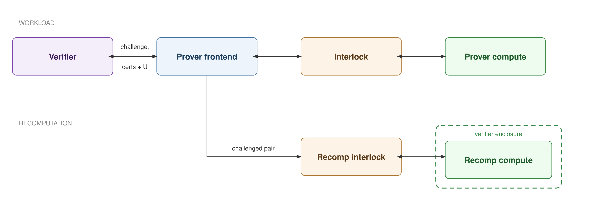

# Interlock Verification Protocol: Logs, Certificates, and Recomputation (v6)

## Two invariants

The whole design rests on two statements:

1. **Everything that passes through is bound by certificates.** Every byte in either direction lands in a time bucket, is hashed, and is committed by an HMAC certificate within one second. This is a hard guarantee, enforced by interlock hardware.
2. **Almost everything bound by certificates is reproducible from the prover's records.** The prover logs the traffic so it can answer challenges — but this is best-effort, not guaranteed.

The asymmetry is the point. **The certificate is the sole authority; the prover record is a convenience replica.** A challenge the record cannot satisfy *consistently with the certificate* is simply a failed challenge, charged as unexplained information. So the prover's logging only needs to be good *enough* to keep its U-rate under budget: a missing or corrupt record degrades gracefully into a U charge rather than breaking soundness, which is why "almost" is the honest word in invariant 2. (This is distinct from interlock-*dropped* packets, which are bound by neither certificate nor record — see Validity rules.)

## Properties

More precisely, the protocol gives the verifier four properties about a compute node's network traffic, and gives the prover one:

- **P1 — Complete attribution.** Every byte leaving the node belongs to exactly one packet in one time bucket; there is no unattributed wire traffic.
- **P2 — No rewriting.** What the prover can later claim about past traffic is fixed at the time the traffic occurred, before any challenge is known.
- **P3 — Measurable explanation.** For any randomly sampled output, the verifier obtains a sound upper bound U on the information in it that is not explained by a declared computation on committed inputs.
- **P4 — Timeline integrity.** Traffic volume and bucket numbering are anchored to wall-clock time; history cannot be stretched, replayed, or run ahead.
- **P5 (prover) — Confidentiality.** The verifier learns packet lengths, request IDs, timing, and U — never payloads, keys, or weights.

Scope: single-shot pairs and multi-part exchanges (multi-turn, long inputs, long outputs) via the reference structure below; size/time-distribution accounting deferred.

<!-- REVISIT have we reviewed this? -->
**Interlock assumptions:**
1. **Reset-free by construction** — the HMAC key and bucket counter share a battery-backed volatile domain, so state loss permanently ends the certificate stream rather than restarting it (re-commissioning with a new key required). Availability-for-simplicity trade: battery failure bricks verification, not traffic.
2. **Speedup resistant** beyond ~2× — slowdown needs no assumption; it is directly visible in the verifier's anchor log.
3. The HMAC key `k` (shared with the verifier) stays secret.
4. Its working memory is tamper-proof.

## The two objects

The protocol is built from two objects:

- a **log** — the traffic itself, stored by the prover;
- a **certificate** — a once-per-second commitment to the log, emitted by the interlock.

The interlock processes the log on the fly and stores none of it. The prover frontend logs everything. The certificate is a deterministic function of the log (plus the latched nonce), so anyone holding a slice of the log can recompute the corresponding hashes: the prover uses this to byte-audit every certificate as it arrives, and the verifier uses it to check any sampled piece of the prover's log at challenge time.


### Roles

- **Interlock:** processes both streams on the fly — enforce validity rules, hash, latch nonces, emit one certificate per second. Processes traffic bucket-by-bucket (~100 KB) and stores no history.
- **Prover frontend:** logs everything — both packet logs with boundary markers, key material, and every certificate — for the challenge window (~30 days). Derived hashes are not stored; digests are recomputed from the log on demand (rehashing one second of traffic is at most ~100 MB of hashing).
- **Verifier:** keeps an anchor log of nonce→certificate round trips, samples challenges, and recomputes hashes over the log slices the prover supplies.

## Log format

A log is a time-ordered sequence of packets; there is one log per direction. Time is divided into 1 ms buckets, and the interlock emits a boundary marker each millisecond (excluded from all hashes) so the prover's log reproduces the interlock's packet→bucket assignment exactly.

**Input (request) packet:**

```
      |127     96|95      64|63      32|31       0|
      +----------+----------+---------------------+  512
      | PLD_LEN  |  BUCKET  |          ID         |
      +----------+----------+---------------------+  384
      |      REFERENCE      |       RESERVED      |
      +---------------------+---------------------+  256
      |                                           |
      +-                KEY_COMMIT               -+  128
      |                                           |
      +-------------------------------------------+    0
```

**Output (response) packet:**


```
      |127     96|95      64|63      32|31       0|
      +----------+----------+---------------------+  512
      | PLD_LEN  |  BUCKET  |          ID         |
      +----------+----------+---------------------+  384
      |                                           |
      +-                                         -+  256
      |                  RESERVED                 |
      +-                                         -+  128
      |                                           |
      +-------------------------------------------+    0
```

### Common HEADER fields

These three fields sit at the top of both frames, so they land at different absolute offsets in the 512-bit request and the 128-bit response.

**PLD_LEN, bits [511:480] \
Length of the ciphertext payload.

<!-- REVISIT OK to use 32 bit BUCKET? it fits nicely in both REQ and RSP -->
**BUCKET, bits [479:448] \
Index of the time bucket the packet is targeting.

<!-- REVISIT do we need the inference flag? -->
**ID, bits [447:384] \
Identifier of the transaction. \
**ID[0]** is the Inference flag, must be set for inference requests. \
ID=0 is RESERVED for control messages.

### Request Only HEADER fields

**REFERENCE, bits [383:320]** \
Identifier of the transaction referenced in the current request. \
Set to 0 (RESERVED) if no previous transaction is referenced. \
The REFERENCE feature provides support for multi-turn conversations and multi-packet messages. See [References and multi-part exchanges](#references-and-multi-part-exchanges). \
REFERENCE must be strictly less than ID.
(A response inherits its context through its request, so it carries no reference.)

**KEY_COMMIT, bits [255:0]** \
Cryptographic commitment to the key material used for this request and its response.


The cleartext header carries only what a trusted party must act on without decrypting during a challenge. Everything else compute or the frontend needs — completion markers, role hints — rides inside the encrypted payload, cert-bound via `pld_digest` but opaque to the interlock and verifier and reproduced naturally by recomputation.

**Validity rules**, enforced by the interlock on the fly (violating packets are dropped — never forwarded, never hashed): \
- `PLD_LEN ≤ S_max`
- `ID` strictly increasing across the session inbound
- `ID` strictly increasing within each bucket outbound (out-of-order responses support)
  - The prover pre-sorts
  - The outbound comparator resets per bucket
- Drops leave no trace in commitments
  - A dropped packet never exits the node, so it carries no exfiltration risk
  - The prover initiates each transaction and notices drops via timeout

## Certificate format

Every second the interlock emits a certificate committing to the last 1000 buckets of both logs, computed incrementally as packets stream through:

```
      |127     96|95      64|63      32|31       0|
      +----------+----------+---------------------+ 1024
      | VERSION  |  DEVICE  | BKT_START| BKT_NUM  |
      +----------+----------+---------------------+  896
      |                   NONCE                   |
      +---------------------+---------------------+  768
      |                                           |
      +-                 INWARD                  -+  640
      |                                           |
      +-------------------------------------------+  512
      |                                           |
      +-                 OUTWARD                 -+  384
      |                                           |
      +-------------------------------------------+  256
      |                                           |
      +-                AUTH_TAG                 -+  128
      |                                           |
      +-------------------------------------------+    0
```

### Certificate message body (m)

**VERSION, bits [1023:992]** \
Bind the certificate to the protocol version.

**DEVICE, bits [991:960]** \
Bind the certificate to the logging device.

**BKT_START, bits [959:928]** \
Index of the first time bucket in the certified interval. \
Must be equal to the previous certificate's BKT_START + BKT_NUM.

**BKT_NUM, bits [927:896]** \
Number of buckets observed in the certified interval. \
Fixed 1000 in the current version.

**NONCE, bits [895:768]** \
Verifier supplied nonce for recency check.
See [Nonce latch](#nonce-latch)

**INWARD, bits [767:512]** \
Cryptographic commitment to the input (request) traffic observed during the certificate interval. \
See [Traffic commitment generation](#traffic-commitment-generation).

**OUTWARD, bits [511:256]** \
Cryptographic commitment to the output (response) traffic observed during the certificate interval. \
See [Traffic commitment generation](#traffic-commitment-generation).

### Certificate authentication tag (τ)

**AUTH_TAG, bits [255:0]** \
Cryptographic authentication tag (τ) of the certificate message body (m). \
Produced using the pre-shared key `k`.

### Traffic commitment generation

The packet level is structured such that:
- The ciphertext hash is a separable leaf: a challenge can reveal a packet's header and `pld_digest` without the ciphertext.
- `PLD_LEN` is also captured in the record alongside pkt_digest so the prover can reveal only length for the rest of the packets in the bucket.

The packet level records are then combined into a bucket level digest, then bucket level digests are combined into a certificate level digest (one in each direction).

```
1. per packet:   pld_digest   = H(PAYLOAD)
                 pkt_digest   = H(HEADER ‖ pld_digest)
                 record       = PLD_LEN ‖ pkt_digest

2. per bucket:   bkt_digest   = H(record₁ ‖ record₂ ‖ …)              (H(ε) if empty)

3. per cert:     cert_digest  = H(bkt_digest₁ ‖ … ‖ bkt_digest₁₀₀₀)   one per direction
```

### Nonce latch
The verifier occasionally sends a plaintext nonce inbound; the interlock latches the latest and echoes it in every certificate. No authentication needed: the verifier credits only nonces it generated, so injecting or replaying nonces is indistinguishable from dropping them — both read as staleness. The interlock generates MACs but never verifies one. Every certificate field is exactly prover-predictable, so the interlock's total covert-output surface is the nonce-latch timing (≤1 bit per nonce update) plus the AUTH_TAG itself (coverable by cut-and-choose, below).

## References and multi-part exchanges

A single request→response pair handles a one-shot prompt that fits in one packet. Everything larger — a multi-turn conversation, a prompt too big for one packet, a response too big for one packet — is built from the same primitive: a request carries a `REFERENCE` pointing at an earlier request whose context it extends. The chain of references is the assembled context.

This costs the interlock nothing. A `REFERENCE` is just bytes in the header that it hashes like any other field; all the chaining logic lives in the (untrusted) frontend and compute and is *verified* after the fact by the verifier walking references through cert-bound records.

**Context assembly.** To recompute the response to request `q`: walk back from `q` along `REFERENCE`, and for each request in the chain include its payload *and its response, if one is cert-bound*. The root (null reference) bottoms out the recursion; its payload is genuine external input. The rule is uniform — *context = the cert-bound chain* — and it covers every case below.

**The three applications, one mechanism:**

- **Multi-turn.** Turn *n*'s request references turn *n−1*'s request; the chain pulls in every prior turn's prompt and response.
- **Long input.** The frontend (or customer) splits a large prompt into chunks sent as a reference chain, all but the last carrying no response. They can be sent in a burst — the chain, not arrival order or bucket position, defines assembly order — subject only to staying under per-bucket capacity `C`. The final chunk is the one that draws a response.
- **Long output.** A response is capped at `S_max`; compute emits a bounded chunk and the frontend issues a continuation request referencing it, which draws the next chunk. The continuation carries no new payload content, only the reference, so it is not an input channel.

**Completion markers live in the encrypted payload.** Whether a request is the final chunk ("compute now") and whether a response is complete (EOS) vs. truncated are decided by compute and the frontend, who hold the keys — not by the interlock or verifier. So these markers are payload tokens, not header fields: cert-bound via `pld_digest`, reproduced by recomputation as ordinary prompt/output tokens, and invisible to the trusted parties. The verifier never needs them — it identifies the response-triggering request by id-match, and intermediate chunks as chain links with no matching response.

**Integrity rules** (checked at challenge time, when the chain is opened):

- *Causality / acyclicity.* `REFERENCE` must be an earlier request: the cheap check is `REFERENCE < ID` (monotonic ids), confirmed by `referenced bucket ≤ referencing bucket` when the link is opened. This rules out cycles and forward references.
- *Cardinality.* One response per request (single-use, as before), but a request may be referenced by *many* later requests — these are different rules. Branching conversations and reuse are fine; a second response to an already-answered request is a violation.
- *No fabricated links.* Every request in the chain must itself open against a certificate, so a prover cannot splice in a fabricated prior to launder covert output — the generalization of the single-pair fabricated-input defense.

**Graceful degradation, again.** If a referenced request or response was cert-bound but is missing from the prover's record, recomputation assembles a short context, mispredicts, and the gap surfaces as U — the same "certificates are authority, records are best-effort" behavior, with no special handling for chains.

## Challenge

1. **Anchor.** Verifier sends a fresh nonce; prover returns the next certificate echoing it, stamping current bucket `B` within `[t_nonce, t_receipt]`. Verifier logs the anchor and checks counter monotonicity and counter rate vs. wall clock.
2. **Select.** Uniform `(bucket y, byte x)` over `[B − window, B] × [0, C)`, where `C` is per-bucket capacity (100 KB at 100 MB/s line rate). Uniform-over-capacity is size-weighted sampling: every transmitted byte is equally likely to be challenged; an `x` past the bucket's content is a cheap liveness check.
3. **Open.** From its log, the prover derives and sends the smallest slice sufficient for the verifier to recompute the certificate: the stored certificate covering `y`, the 1000 output `bkt_digest` from that second, bucket `y`'s records, and the hit packet's header and `pld_digest` — plus the same opening for the matching input packet in bucket `w` (certificate, 1000 `bkt_digest`, records, HEADER, `pld_digest`, `KEY_COMMIT`). If `Σ PLD_LEN < x` the record list alone proves emptiness and the challenge ends. Under the ZKP option no ciphertext is ever sent to the verifier.
4. **Recompute.** The prover supplies a recomputation certificate (next section) binding to the opened values.
5. **Verify**, in order: (a) both certificates' AUTH_TAGs and `DEVICE` against the anchor log; (b) the supplied 1000 `bkt_digest` recompute each certificate's `cert_digest` (INWARD and OUTWARD); (c) the records recompute the two `bkt_digest`; (d) byte `x` falls in the claimed packet per cumulative `PLD_LEN`; (e) input binding — the response's context chain (References) opens against certificates, each link earlier than the next, `ID`s matching, the challenged request having explained no other response; (f) the recomputation certificate verifies against `(H1_in, H2, H1_out)`, yielding U.

Input binding closes the fabricated-input cheat (a "request" containing the covert output would recompute with zero surprisal); single-use closes its amortized variant (one innocent request explaining many responses). For a single-shot pair the chain is one link; for multi-part exchanges it is the full reference chain, opened the same way.

## Recomputation certificate

A recomputation certificate attests, for one challenged pair: *"the response tokens whose ciphertext hashes to `H1_out`, decrypted under keys hashing to `H2`, carry at most U bits not explained by the declared computation D applied to the prompt tokens whose ciphertext hashes to `H1_in`."* All three recomputation options (prover recomputation, verifier recomputation, ZKP) implement this same interface; what differs is who is trusted for faithful execution.

### ZKP instantiation (per the infproof implementation)

{ width=100% }

- **Public inputs:** U (in bits), `H1_in`, `H1_out`, `H2`, the model-weight commitment `R_W`, and the claim structure from which the verifier *compiles its own constraint system* — it never trusts prover-supplied constraints.
- **Hidden witness:** weights, prompt tokens, response tokens, logits, all intermediate activations (committed behind Merkle roots `R_W`, `R_p1`, `R_p2`).
- **Proven statement:** `SHA256(AES(tokens_in, key)) = H1_in`, `SHA256(AES(tokens_out, key)) = H1_out`, `SHA256(key) = H2`; the same committed tokens feed the embedding lookup and the hidden output selection (MaxClaim), so the bound applies to the *transmitted* tokens, not free-floating ones; logits = D(W, x) for the declared architecture; per-token probabilities follow the pinned hardware-noise model `Q_t(o_t) ∝ exp(−(v* − ℓ_{o_t})²/s_c)` with all rounding pushed upward, so `U_proved ≥ U_true`.
- **Why (H1, H2) suffice:** they are the only bridge needed between the interlock's world (hashes of wire bytes) and the circuit's world (token values). H1 values are leaves of interlock-committed packet hashes; H2 is the `KEY_COMMIT` committed inside the input packet at request time — before the response existed, so keys cannot be chosen retroactively to fit a covert payload.
- **Parameters (current implementation):** Ligero over the Goldilocks field with Reed–Solomon + BLAKE3 Merkle commitments — hash-based throughout, no trusted setup, post-quantum. Proof ≈ 150 MB, verification ≈ 13 min for a 32-layer 7B model; the token-binding constraints add ~10⁶ constraints (~0.01% of the proof).

### Prover-recomputation instantiation (Option 1, mediated by a recomputation interlock)

The prover's own hardware recomputes inside a verifier enclosure; a second, simpler interlock mediates all data crossing the enclosure boundary and emits the certificate.

{ width=100% }

**Setup (before the workload phase):** the recomputation node enters the enclosure loaded only with pre-committed data (weights, execution engine). It must not be — or share state with — the node that ran the workload: a node that remembers the challenged response can replay any covert payload at probability 1 and launder it as "explained." If hardware is reused across challenge sessions, memory is wiped between them.

**Challenge-time ingress is gated by commitments.** The recomputation interlock feeds the enclosure exactly three things:
1. the input-packet ciphertext, which it hashes itself and checks against `H1_in`;
2. the cryptographic material (key, nonces), which it hashes and checks against `H2`. This ingress is what makes H2 load-bearing here: the node needs the key to decrypt the prompt and to compute per-position encrypted output units, but the key material enters *after* the response exists — unpinned, the staged blob could smuggle the answers in (e.g., contain the response itself alongside the true key). H2 was fixed in the input packet at request time, before the response existed, so the staged material cannot be chosen retroactively to fit a covert payload;
3. the challenged output ciphertext, one unit at a time, each revealed only after the node commits its prediction for that position.

**Scoring runs in ciphertext space** — the interlock never decrypts. At each position the node commits a table of `(ciphertext_unit → probability)` entries; the interlock checks the table is a sub-distribution (`Σ q ≤ 1`, with the residual mass defined as uniform over unlisted unit values, so misses score ~32+ bits rather than ∞ and Q stays a valid distribution — without this check the node could commit probability ≈1 for everything); then it looks up the actual unit, records the surprisal, and reveals the unit. Predicting ciphertext units well requires the true key and the true computation, so the scoring itself needs no key check. A hardware-friendly variant restricts probabilities to dyadic values: the node commits integer (or quarter-bit) surprisals `s_j`, the interlock checks `Σ 2^(−s_j) ≤ 1` by shift-and-add, and U accumulates without any log circuit, costing the honest prover ≤1 bit/token. Optionally, tables have a fixed size every step (dummy entries at floor probability, randomized order) so the interlock learns nothing from distribution shape.

**Certificate:** `m = ("recomp-v1", recomp_interlock_id, challenge_nonce, H1_in, H2, H1_out, n_units, U)`, `τ = HMAC_k₂(m)`, where `H1_in` and `H2` were verified against the actual staged bytes and `H1_out` is the interlock's own hash of the ciphertext it revealed — all recomputed from bytes, none trusted from the prover. The verifier checks these equal the values opened from the network certificates. Binding to `challenge_nonce` makes the device **stateless**: no buckets, no timeline, no battery-backed counter — its assumptions reduce to key secrecy and side-channel hardening. Every field is prover-predictable, so the byte-audit and slot-bound cut-and-choose carry over with slot = nonce. There is no duration field — a measured-time value has slack the prover cannot predict (the same covert-channel reasoning that removed drop counters); the verifier times the challenge on its own clock.

Both instantiations bind the same triple `(H1_in, H2, H1_out)` and end at the same interface; they use H2 oppositely — the ZKP to connect plaintext tokens to wire bytes inside the circuit, Option 1 to pin what may enter the enclosure after the response exists.

**End-to-end chain:** wire bytes → log → certificate (fixed within 1 s of transmission) → H1/H2 → tokens → U. The verifier needs nothing but its anchor log, the opened log slices, and the recomputation certificate.

**Worked sizes:** anchor certificate ~150 B → challenge ~12 B → opening ≈ 2 certificates + two 32 KB `bkt_digest` lists + two record lists (~48 B/packet) + two headers with hashes (~100 B) → recomputation certificate ~150 MB (ZKP option). Everything outside the recomputation verifies with a few hundred hashes over ~100 KB.

**Certificate-release audit (optional):** since every certificate field is prover-predictable, a prover worried about covert bits in AUTH_TAGs can release challenge-time tags via slot-bound cut-and-choose: the verifier binds one commitment per certificate slot *before* revealing its own τ′ — it must never act as an unrestricted HMAC oracle.

## Spec decisions

1. **One key commitment per pair.** `KEY_COMMIT` (`H2 = H(key material)`) covers both the request and its response, carried in the input packet (matching the paper's packet format). Per-direction keys would require a second commitment field.
2. **Hash alignment.** `pld_digest` (`H(PAYLOAD)`) must be the hash the ZKP circuit proves — SHA-256 — so the interlock's payload-hashing block is SHA-256. The log/certificate levels never enter the circuit and could differ, but everything stays SHA-256 for one gateware core.
3. **AES mode.** The cipher must allow position-addressable fixed-width token units (e.g., AES-CTR with fixed bytes-per-token serialization) so recomputation options can address individual token ciphertexts without decrypting the stream.

## Suggested parameters

`H` = SHA-256; MAC = HMAC-SHA-256 (pre-shared `k`); bucket = 1 ms; certificate period = 1 s; `ID` = 64-bit; `S_max` = deployment-set; per-bucket capacity `C` = 100 KB; challenge window = 30 days (prover-side log storage).
